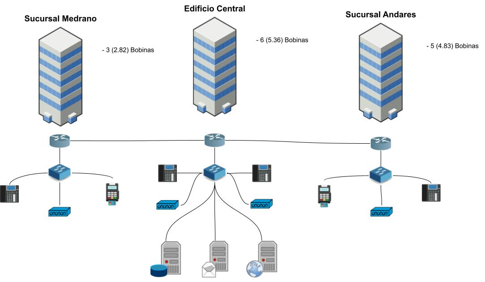
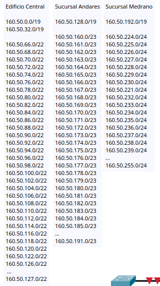

# Red Final Redes de Computadoras

El trabajo se presentará en binas y un equipo será de 3 personas.
Documento de word, con la cotización FORMAL.
Archivo de Packet Tracer donde se simule la red que se solicitó en el documento adjunto.

## Documentos a Entregar:
:paperclip: 
:paperclip: 

## Capturas de la visualización del proyecto

